# [row_assist](https://row-assist-0ee155171c88.herokuapp.com)

Developer: Geraldine Morey ([geraldine-mor](https://www.github.com/geraldine-mor))

[](https://www.github.com/geraldine-mor/row_assist/commits/main)
[](https://www.github.com/geraldine-mor/row_assist/commits/main)
[](https://www.github.com/geraldine-mor/row_assist)
[](https://row-assist-0ee155171c88.herokuapp.com)

```title banner
 ██████╗  ██████╗ ██╗    ██╗    █████╗ ███████╗███████╗██╗███████╗████████╗
 ██╔══██╗██╔═══██╗██║    ██║   ██╔══██╗██╔════╝██╔════╝██║██╔════╝╚══██╔══╝
 ██████╔╝██║   ██║██║ █╗ ██║   ███████║███████╗███████╗██║███████╗   ██║
 ██╔══██╗██║   ██║██║███╗██║   ██╔══██║╚════██║╚════██║██║╚════██║   ██║
 ██║  ██║╚██████╔╝╚███╔███╔╝   ██║  ██║███████║███████║██║███████║   ██║
 ╚═╝  ╚═╝ ╚═════╝  ╚══╝╚══╝    ╚═╝  ╚═╝╚══════╝╚══════╝╚═╝╚══════╝   ╚═╝
```

Row Assist is a command-line indoor rowing assistant that takes the user's indoor rowing 2k test performance data and calculates the watts generated and average /500m split time, compares the user's performance to a reference table and returns a ranking. 

The application runs as a single-use session with 2 modes of operation: **persistent user** and **guest**. The persistent user enters their login name and latest 2k test time, guest users are asked to enter their demographic attributes (age & gender) as well as their latest rowing test data.

The app then provides user feedback based on the data provided. The persistent user is offered the opportunity to store their workout info prior to exit, the guest user is not. 

This model reflects real-world rowing practice where rowing tests occur as distinct events. Feedback remains visible on screen until the program is exited or run again. Running the program implies either a new test has been completed or another user wishes to evaluate their data. 

## Instructions

**How to use Row Assist**

_Please avoid typing during the typewriter animation as this can interfere with the output and cause unnecessary delays._

**User:**

You will be greeted and asked to enter your login or press 'Enter' to continue as a guest

The 'Login' for demonstration purposes is "demo"

You will be asked to enter the time of your last 2k test. _This is broken in to 3 inputs, minutes, seconds and tenths to ensure correct input format_

With this information, the program calculates the 2 standard rowing metrics of split time and watts, and reports these back to you.

The program also delivers a performance category or ranking and explains how this category compares to other rowers in your demographic.

You are then offered the option to save or discard the data before being asked if you would like to exit or restart.

Should the API connection fail, you will receive an error message before being offered the option to exit or restart.

**Guest:**

After the greeting, press 'Enter' to enter guest mode. You will be prompted to enter your age and indicate your gender before being asked to enter your time as above.

The program delivers the same feedback but will not offer the option to save prior to exiting.

## UX

 **MVP** <br>
 A command-line indoor rowing assistant that collects basic user and performance data, calculates derived metrics, compares them against performance standards and provides tailored, categorised feedback to the user.

### The 5 Planes of UX

#### 1. Strategy

**Purpose**
- Provide users with alternative metrics for their workout 
- Give users feedback about their performance 

**Primary User Needs**
- Receive meaningful feedback for a completed indoor row
- Compare performance against global averages 
- Receive a performance rank for completed indoor row

**Business Goals**
- Offer a reliable tool for analysing rowing performance
- Accurately calculate metrics and classify user performance
- Deliver feedback in a clear and insightful manner

#### 2. Scope

**[Features](#features)** (see below)

**Content Requirements**
- Input content - user attributes (age, gender) and row performance data (time)
- Reference content - Google sheet containing categorised, searchable data sorted by gender, age range, watt threshold and performance category
- Derived content - system calculated values for watt output and 500m split time 
- Feedback content - calculated values (split and watts) and performance category (beginner - world record) with contextual explanation of category
- Persistent content - Optional storage of user workout data for persistent users
- Future content - trend analysis, visual charts
<br>

**Content Constraints**
- Only 2000m tests accepted
- Age must map to a defined range
- Only male & female categories supported
- HW and LW categories removed due to lack of available data
- The deployment terminal is set to 80 columns wide by 24 rows

#### 3. Structure

**Information Architecture**
- **Hierarchy**:
  - User demography and row performance data input as the primary focus for ease of use

**User Flow**
1. User opens the app → user views greeting and instructions
2. User enters data as prompted → system checks data for type and validity → generates error message if invalid, proceeds if valid
3. System computes metrics and compares to reference document → user receives feedback messages
4. If applicable, user chooses whether to save data → is informed of successful save or deletion
5. User chooses whether to exit the program or restart

**[Flowchart](#flowchart)** (see below)

#### 4. Skeleton

**Terminal Layout**
- 80 columns × 24 rows display constraint
- ASCII art branding header (ROW ASSIST logo)
- ASCII art footer (rowing machine illustration)
- Single-line spaces used throughout to create visual space between sections

**Visual Hierarchy**
- Application title: Large ASCII art letterforms
- Welcome message: Standard text, left-aligned below header
- Instructions: Plain text paragraph format
- Prompts: Single-line, left-aligned with descriptive label
- User input: Inline continuation of prompt line
- Confirmation messages: Standalone line (e.g., "You entered: 7:45.6")
- Processing indicators: Action statements ("Retrieving your ranking, please wait...")
- Results: Each metric on its own line, label followed by colon and value
- Performance feedback: Multi-line paragraph format with category emphasized
- Navigation prompts: Instruction line with options specified

**Output Formatting**
- Calculated metrics: Label format - "Your split time is: [value]"
- Time display: Standard format mm:ss.d (e.g., "1:56.4")
- Performance category: Emphasised with exclamation mark ("Advanced!")
- Contextual explanation: Multi-line plain text with comparison percentage

**Input Structure**
- Sequential single-field prompts for each data point
- Time entry broken into three separate inputs (minutes, seconds, tenths)
- Confirmation display before processing
- Single-key commands for save/discard and exit/restart choice

**Message Types**
- Instructions: Conversational, second-person ("You will soon be asked...")
- Prompts: Direct, imperative ("Please enter your age")
- Feedback: Encouraging, second-person ("Fantastic performance...")
- System actions: Present progressive ("Calculating...", "Retrieving...")

Wireframes were not prepared for this project due to the visual and navigational constraints of the terminal environment. Wireframes serve primarily as a GUI design tool and I deemed it inappropriate since CLI applications have no GUI.

This sample output clearly demonstrates the layout, spacing and formatting chosen.

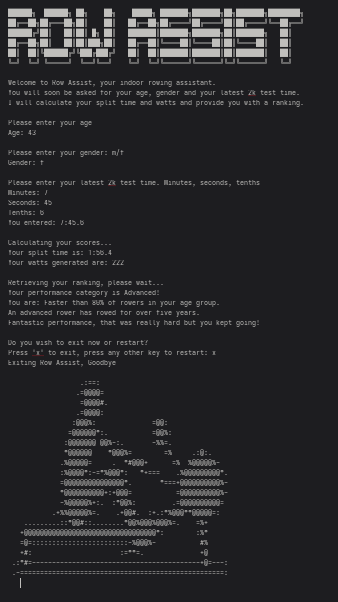

#### 5. Surface

**Visual Design Elements**
- **Graphics** - ASCII graphics were added for a heading and closing image.
- **Animation** - A typewriter effect was added to the print statements to create a more interactive feel.
- **Emojis** - Lightning bolt emojis were used to emphasise speed in the Flash reference for sub world record time entries.

## Flowchart

To follow best practice, a flowchart was created to showcase the progression of the Python app.The flowchart below represents the main process of this Python program. It shows the entire cycle of the application. 

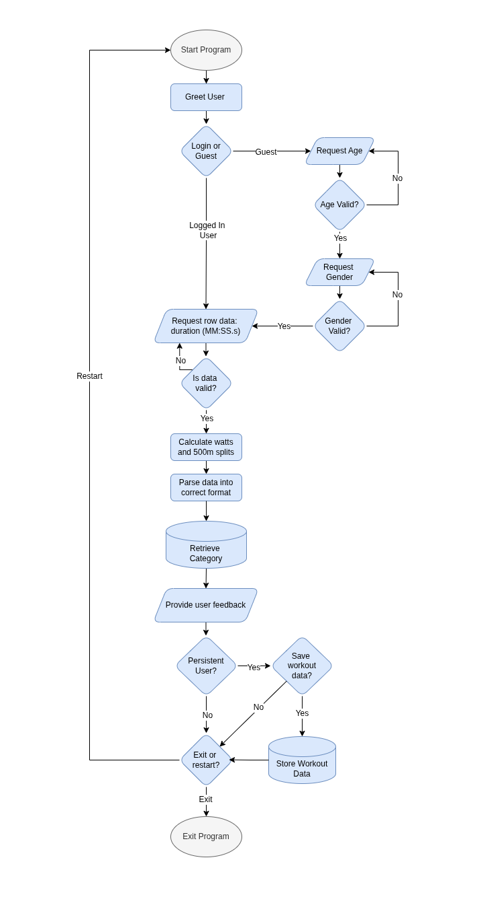

I used [draw.io](https://www.drawio.com/) to design my app flowchart.
I used [chatGPT](http://www.chatgpt.com) and [Mermaid Chart](http://www.mermaid.ai) to convert the flowchart to an interactive mermaid version.

The Mermaid version can be found [here](https://mermaid.ai/app/projects/212e9a6a-2b8a-4b72-be94-8a77217d6f55/diagrams/ccf39e03-b715-4b69-a013-1cd69f5dea7f/version/v0.1/edit)

## User Stories

| Target | Expectation | Outcome | Classification |
| --- | --- | --- | --- |
| As a user | I want to be greeted and receive clear instruction throughout | so that I understand and can use the app fully and easily. |  |
| As a rower | I would like to input my age, gender and 2000m time | so that the app can evaluate my performance. |  |
| As a rower | I would like the app to calculate my split time and watts | so that I can understand more about my workout. |  |
| As a rower | I would like the application to compare my output to reference data | so that I can receive a category ranking relevant to my demographic. |  |
| As a rower | I would like information about my ranking category | so that I can understand how my ranking compares to others. |  |
| As a coach | I would like to choose between exiting the program and restarting | so that all my athletes can enter their data. |  |
| As a returning user | I would like the application to store my performance tests | so that I can track improvements over time. |  |
| As a returning user | I would like to see trends in my performance | so that I can evaluate my training effectiveness. |  |
| As a returning user | I would like to see visual charts of my performance history | so that progress is easy to interpret and compare. |  |
| As a rower | I would like to enter alternative distances | so that I can evaluate performance over a range of tests. |  |
| As a lightweight rower | I would like to see weight class adjustments | so that rankings are fair and my feedback is relevant |  |
| As a new user | I would like to create a profile | so that my details don't need to be re-entered each time. |  |
| As a returning user | I would like to update my profile | so that performance comparisons remain valid. |  |
| As a coach | I want to view performance data for multiple athletes | so that can track progression and develop training interventions. |  |

## Features

### Existing Features

| Feature | Notes | Screenshot |
| --- | --- | --- |
| Greeting | Greets the user and provides instruction about how to use the app. |  |
| Data Collection | Requests the user's age, gender and latest 2k test time. |  |
| Input Validation | Validates that the age provided is in the range 10-90, that the gender provided is either m or f and that the minutes and seconds are in the range 0-59 and the tenths 0-9. |  |
| Time Transformation | Time inputs are _collated_ into the format mm:ss.d for user display and _parsed_ to total seconds for calculations. |  |
| Split-time Calculation | Calculates the split-time from the data provided and displays it to the user. |  |
| Watts Calculation | Calculates watts from from the generated split-time value and displays it to the user. |  |
| Performance Ranking | Retrieves the performance category and corresponding description from the relevant Google Sheets worksheet based on age, gender and watts value and displays them to the user. |  |
| Program Exit / Restart | Asks the user to exit or restart. Exit closes the program safely and restart begins the program again with a clear terminal. |  |
| User Identity Decision | Asks the user to enter their login or continue as guest | 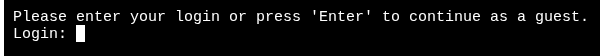 |
| Save Data | Persistent user is offered the option to store the workout data, if y entered, then data is saved to the google sheet | 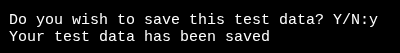 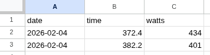 |

### Future Features

- **Performance progression comparison**: Provide user feedback based on past performances.  
- **Data Visualisation**: Add charts and graphs to visually represent performance trends.
- **Add Multiple Distance Options**: Allow the user to input the row distance instead of only 2000m.
- **Add User Weight Category**: Allow user to specify weight category (HW or LW) for fairer comparisons.
- **User Profile Management**: Allow users to create, access and update profiles containing demographic information and performance history.
- **Dashboard**: Provide users with user-friendly dashboard to view results and feedback.
- **User login types and roles**: Implement different user types and assign roles to facilitate coach oversight of multiple athletes.
- **Dashboard Options**: Provide setup options for single user or coach/club group management.
- **Predictive Analytics**: Use historical performance data to predict future results giving the athletes personalised training targets.
- **Multilingual Support**: Add support for multiple languages to make the app more accessible to a global audience.
- **Mobile App Integration**: Develop a mobile version of the app for rowing feedback in any gym and on the go.
- **Reporting and Exporting**: Generate and export detailed reports in PDF or CSV format for deeper analysis of performance metrics over time.
- **API Integration**: Provide an API for integrating with other third-party services, such as concept2's ErgData or fitness trackers and heart rate monitors.

## Tools & Technologies

| Tool / Tech | Use |
| --- | --- |
| [](https://markdown.2bn.dev) | Generate README and TESTING templates. |
| [](https://git-scm.com) | Version control. (`git add`, `git commit`, `git push`, `git pull`) |
| [](https://github.com) | Secure online code storage. |
| [](https://code.visualstudio.com) | Local IDE for development. |
| [](https://www.python.org) | Back-end programming language. |
| [](https://www.heroku.com) | Hosting the deployed back-end site. |
| [](https://docs.google.com/spreadsheets) | Storing data from my Python app. |
| [](https://chat.openai.com) | Help with initial planning. |
| [](https://www.drawio.com) | Flow diagrams for mapping the app's logic. |
| [](https://www.w3schools.com) | Tutorials/Reference Guide. |
| [](https://stackoverflow.com) | Tutorials/Reference Guide. |
| [](https://www.geeksforgeeks.org/) | Tutorials/Reference Guide. |
| [](https://labex.io/tutorials) | Tutorials/Reference Guide. |
| [](https://www.reddit.com/) | Tutorials/Reference Guide. |
| [](https://claude.ai) | Help debug, troubleshoot, and explain things. |
| [](https://mermaid.ai/) | Create interactive flowchart | 
| [](https://www.asciiart.eu/) | Create ASCII graphics. |

## Database Design

### Data Model

The Row Assist app uses Google Sheets as its data repository with a structured, scalable design to support multiple demographics and distances.

Reference data is organised into separate worksheets following the naming convention: `{gender}_{distance}` (currently `m_2000` and `f_2000`) but the app has been designed in a way to accommodate more sheets in future, allowing for the inclusion of alternative distances.

Each reference sheet contains age range boundaries in the first 2 columns and performance category watt thresholds (columns 3-8), with category names stored as column headers.

A separate worksheet titled `categories` provides detailed descriptions for each performance category. 

A final worksheet titled `demo` stores the persistent user's saved workouts

To follow best practice, a charts were created for the app's data structure, data flow and logic. I mapped them out using [Draw.io](https://www.draw.io). 

#### Data structure diagram

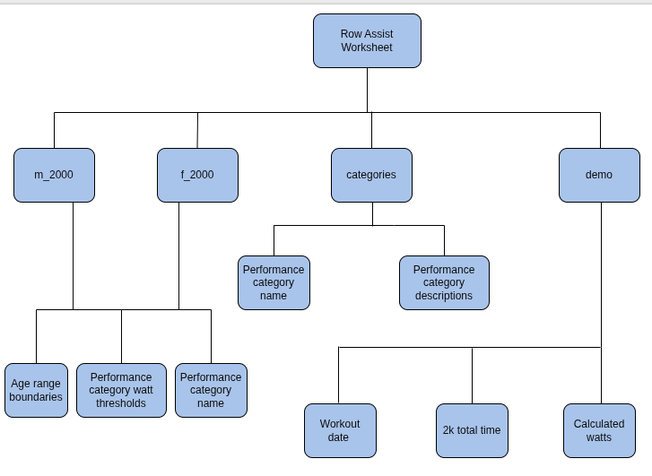

#### Data flow diagram

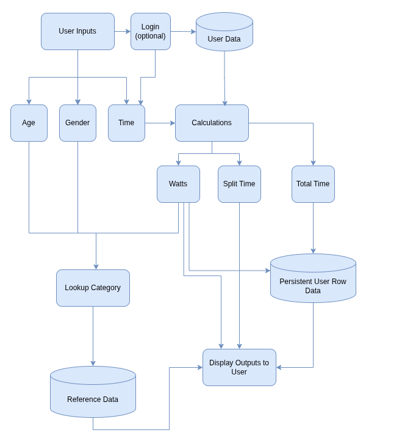

#### Key Design Decisions

- The use of `distance` variable and `{gender}_{distance}` sheet naming convention allows for much easier scalability should extra distances be added in future.
- Performance thresholds are defined in whole number watts rather than split-times. While split-times may be the domain standard metric, watts are highly standardised within the domain and are far easier to compute. 
- The raw data provided only single age figures in 5-year jumps, these were transformed into 5-year age ranges to allow for more consistent lookup and to preserve domain realism.
- Three-part time input (minutes, seconds, tenths) was chosen to reduce user errors, simplify validation and align with domain standard inputs:

*Examples of time entry formats from Concept2 platforms:*

|  |  |
| --- | --- |
|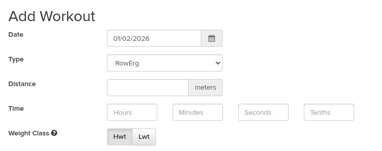 | 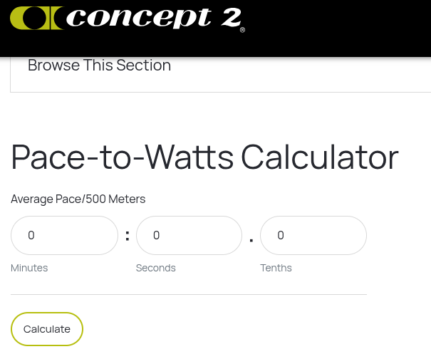 |

- The application was split into modules with new modules created for input handling, validation, calculation, utilities and spreadsheet communication. The program was separated into smaller files to improve readability, testing and future expansion.
- Validation checks for structurally valid inputs and does not screen for realistic values. Unrealistic but valid values (such as world record performances) are permitted with appropriate user messaging. This is in part to separate the concerns of validity and realism and also to allow for multiple distance entries in the future where a valid 500m time entry would definitely be below 2km world record time.
- 2000m was chosen as the MVP scope boundary since it is the international gold standard of indoor rowing.
- An exit/restart loop was chosen over exiting after each run to reflect real-world cases of multi-user or repeated-use scenarios such as rowing clubs or shared terminals. 
- A lightweight login mechanism was implemented to support a demo user and guest usage without introducing full authentication complexity.
- Despite the lack of secure user login credential validation, the user mode selection intput is called "Login" for ease of comprehension and improved user experience.
- Exit confirmation omitted in favor of better UX. Users are prompted to save results immediately after viewing feedback, when the decision is most relevant. This eliminates the need for a generic "Are you sure?" at exit.

#### Functions

The primary functions used on this application are:

- `typed()`
    - Display text to the terminal with a typewriter effect. 
- `check_user()`
    - Validates username/offers guest access and returns age, gender and login status. 
- `calculate_age()`
    - Calculates user age from stored Date of Birth.       
- `get_age()`
    - Get age input from the user.
- `validate_age()`
    - Check age input is an integer in the range 10-90.
- `get_gender()`
    - Get gender input from the user.
- `validate_gender()`
    - Check gender input is either m or f.
- `get_time()`
    - Get minutes and seconds inputs from the user.
- `validate_time()`
    - Check time inputs are integers in the range 0-59.     
- `get_tenths()`
    - Get tenths inputs from the user. 
- `validate_tenths()`
    - Check tenths input is an integer in the range 0-9.
- `get_row_time()`
    - Collect all time data, format into user readable string and parse into a total seconds float for calculations. 
- `calculate_splits()`
    - Calculate split time from inputs.  
- `calculate_watts()`
    - Calculate watts from calculated split time. 
- `get_row_number()`
    - Compare user's age against spreadsheet age ranges to find the correct row number.  
- `get_col_number()`
    - Check watts against the thresholds in the retrieved data row to find the correct column number. 
- `get_category()`
    - Retrieve the correct column heading from the reference worksheet.
- `get_category_description()`
    - Retrieve performance categories and descriptions from spreadsheet and convert to dictionary for lookup.  
- `lookup_category()`
    - Run all data lookup functions to determine user's performance category. 
- `save_row_data()`  
    - Provides option for persistent user to save the workout data.  
- `program_exit()`
    - Ask user to choose between exit and restart.
- `main()`
    - Run all program functions.
- `run()`
    - Handle the exit program loop: exit if condition is met, otherwise restart.   

#### Imports

I used the following Python packages and external imports:

**Core Dependencies**

- `gspread`: Essential for Google Sheets API integration. Chosen because it provides an interface for reading/writing spreadsheet data, eliminating the need for a traditional database while maintaining persistent data capabilities.
- `google.oauth2.service_account`: Required for authentication with Google Sheets API. Handles credential management necessary for authorised API access.

**Standard Library**

- `time`: Used `sleep()` function to implement typewriter effect for enhanced user experience with progressive text display.
- `math`: Required for `floor()` function in split-time calculations to ensure rounding behavior consistent with rowing ergometer display conventions.
- `os`: Used `os.system()` to enable cross-platform terminal clearing  ensuring a clean interface for each program run.
- `datetime`: Necessary for calculating user age from stored Date of Birth and timestamping saved workout data. Provides reliable date arithmetic. 
- `gspread.exceptions`: Facilitate graceful error handling for API connectivity and worksheet issues, allowing the program to inform users of problems rather than crashing.
- `google.auth.exceptions`: Facilitate graceful error handling for authentication issues, allowing the program to inform users of connection problems rather than crashing.

## Agile Development Process

### GitHub Projects

[GitHub Projects](https://www.github.com/geraldine-mor/row_assist/projects) served as an Agile tool for this project. Through it, User Stories and issues/bugs were planned and tracked using a Kanban project board.

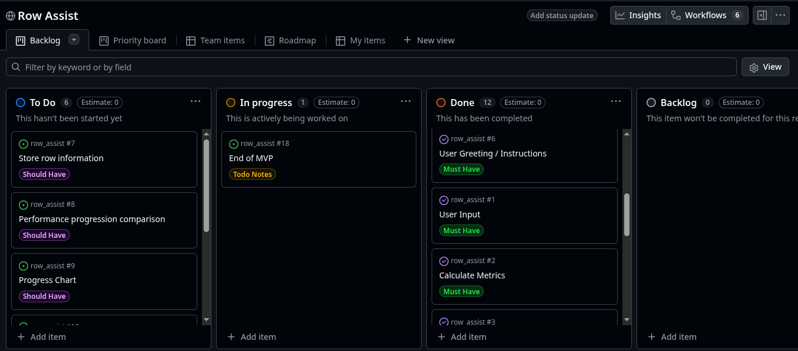

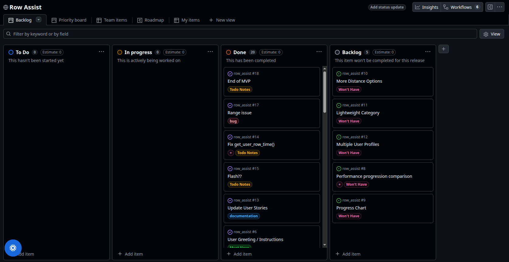
### GitHub Issues 

[GitHub Issues](https://www.github.com/geraldine-mor/row_assist/issues) served as an another Agile tool. There, I managed my User Stories and tracked any issues/bugs.

I used issue comments as I went along to help with the thought process. The ability to paste screenshots directly is a huge time saver. Examples of this can be found [here](https://github.com/geraldine-mor/row_assist/issues?q=label%3A%2B). 

All [bugs](TESTING.md#bugs) are processed in this manner also.

| Link | Screenshot |
| --- | --- |
| [](https://www.github.com/geraldine-mor/row_assist/issues?q=is%3Aissue%20is%3Aopen%20-label%3Abug) | 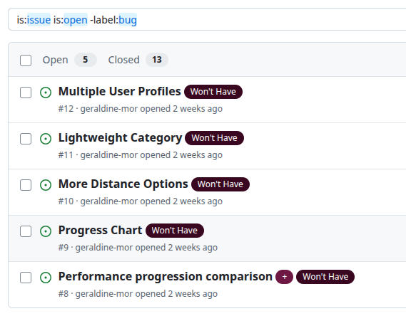 |
| [](https://www.github.com/geraldine-mor/row_assist/issues?q=is%3Aissue%20is%3Aclosed%20-label%3Abug) | 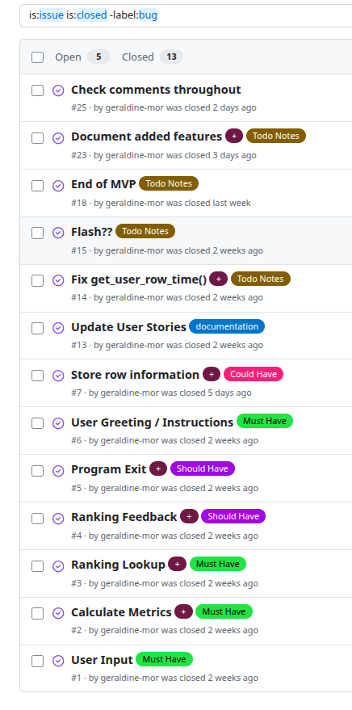 |

### MoSCoW Prioritization

I categorised my User Stories for prioritising and implementing them. Using this approach, I was able to apply "MoSCoW" prioritisation and labels to my User Stories within the Issues tab.

- **Must Have**: guaranteed to be delivered - required to Pass the project
- **Should Have**: adds significant value, but not vital
- **Could Have**: has small impact if left out
- **Won't Have**: not a priority for this iteration - future features

## Testing

> [!NOTE]  
> For all testing, please refer to the [TESTING.md](TESTING.md) file.

## Deployment

Code Institute has provided a [template](https://github.com/Code-Institute-Org/python-essentials-template) to display the terminal view of this backend application in a modern web browser. This is to improve the accessibility of the project to others.

The live deployed application can be found deployed on [Heroku](https://love-sandwiches-gm-c489adc8c525.herokuapp.com).

### Heroku Deployment

This project uses [Heroku](https://www.heroku.com), a platform as a service (PaaS) that enables developers to build, run, and operate applications entirely in the cloud.

Deployment steps are as follows, after account setup:

- Select **New** in the top-right corner of your Heroku Dashboard, and select **Create new app** from the dropdown menu.
- Your app name must be unique, and then choose a region closest to you (EU or USA), then finally, click **Create App**.
- From the new app **Settings**, click **Reveal Config Vars**, and set the value of **KEY** to `PORT`, and the **VALUE** to `8000` then select **ADD**.
- If using any confidential credentials, such as **CREDS.JSON**, then these should be pasted in the Config Variables as well.
- Further down, to support dependencies, select **Add Buildpack**.
- The order of the buildpacks is important; select `Python` first, then `Node.js` second. (if they are not in this order, you can drag them to rearrange them)

Heroku needs some additional files in order to deploy properly.

- [requirements.txt](requirements.txt)
- [Procfile](Procfile)
- [.python-version](.python-version)

You can install this project's **[requirements.txt](requirements.txt)** (*where applicable*) using:

- `pip3 install -r requirements.txt`

If you have your own packages that have been installed, then the requirements file needs updated using:

- `pip3 freeze --local > requirements.txt`

The **[Procfile](Procfile)** can be created with the following command:

- `echo web: node index.js > Procfile`

The **[.python-version](.python-version)** file tells Heroku the specific version of Python to use when running your application.

- `3.12` (or similar)

For Heroku deployment, follow these steps to connect your own GitHub repository to the newly created app:

Either (*recommended*):

- Select **Automatic Deployment** from the Heroku app.

Or:

- In the Terminal/CLI, connect to Heroku using this command: `heroku login -i`
- Set the remote for Heroku: `heroku git:remote -a app_name` (*replace `app_name` with your app name*)
- After performing the standard Git `add`, `commit`, and `push` to GitHub, you can now type:
	- `git push heroku main`

The Python terminal window should now be connected and deployed to Heroku!

### Google Sheets API

This application uses [Google Sheets](https://docs.google.com/spreadsheets) to handle a "makeshift" database on the live site.

To run your own version of this application, you will need to create your own Google Sheet. Please access the reference data from [this Google Sheet](https://docs.google.com/spreadsheets/d/119Xo6s5GHh3TByg5RX9KweasEAjIXfFIDiJ2PawTKCo/edit?usp=sharing) or the screenshots below:

*Sheet must be named m_2000*
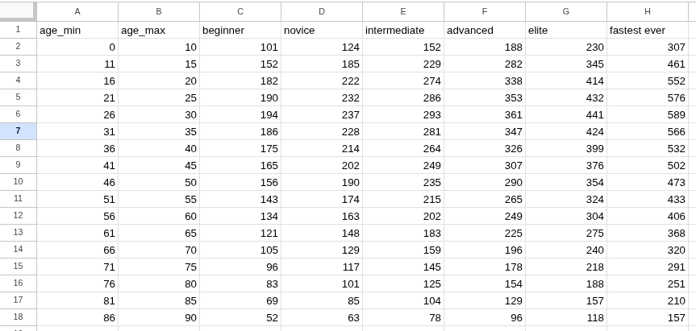

*Sheet must be named f_2000*
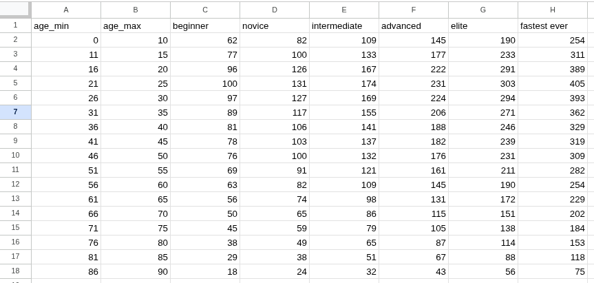

*Sheet must be named categories*
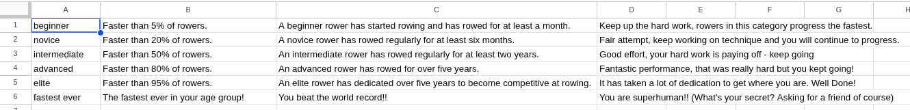

A credentials file in `.JSON` format from the Google Cloud Platform is also mandatory:
[Google Cloud Platform](https://console.cloud.google.com)

As this application is dependent upon the API connection, an error handler was included to inform the user that the connection was lost and proceeds to the exit/restart question.

1. From the dashboard click on "Select a project", and then the **NEW PROJECT** button.
2. Give the project a name, and then click **CREATE**.
3. Click **SELECT PROJECT** to get to the project page.
4. From the side-menu, select "APIs & Services", then select "Library".
5. Search for the "Google Drive API", select it, and then click on **ENABLE**.
6. Click on the **CREATE CREDENTIALS** button.
7. From the "Which API are you using?" dropdown menu, choose **Google Drive API**.
8. For the "What data will you be accessing?" question, select **Application Data**.
9. Click **Next**.
10. Enter a "Service Account" name, then click **Create**.
11. In the "Role" dropdown box, choose "Basic" > "Editor", then press **Continue**.
12. "Grant users access to this service account" can be left blank. Click **DONE**.
13. On the next page, click on the "Service Account" that has been created.
14. On the next page, click on the "Keys" tab.
15. Click on the "Add Key" dropdown, and select "Create New Key".
16. Select `JSON`, and then click **Create**. This will trigger the `.json` file with your API credentials in it to download to your machine locally.
17. For local deployment, this needs to be renamed to `creds.json`.
18. Repeat steps 4 & 5 above to add the "Google Sheets API".
19. Copy the `client_email` that is in the `creds.json` file.
20. Share your Google Sheet to the `client_email`, ensuring "Editing" is enabled.
21. Add the `creds.json` file to your `.gitignore` file, so as not to push your credentials to GitHub publicly.

### Local Development

This project can be cloned or forked in order to make a local copy on your own system.

For either method, you will need to install any applicable packages found within the [requirements.txt](requirements.txt) file.

- `pip3 install -r requirements.txt`.

If using any confidential credentials, such as `CREDS.json` or `env.py` data, these will need to be manually added to your own newly created project as well.

#### Cloning

You can clone the repository by following these steps:

1. Go to the [GitHub repository](https://www.github.com/geraldine-mor/row_assist).
2. Locate and click on the green "Code" button at the very top, above the commits and files.
3. Select whether you prefer to clone using "HTTPS", "SSH", or "GitHub CLI", and click the "copy" button to copy the URL to your clipboard.
4. Open "Git Bash" or "Terminal".
5. Change the current working directory to the location where you want the cloned directory.
6. In your IDE Terminal, type the following command to clone the repository:
	- `git clone https://www.github.com/geraldine-mor/row_assist.git`
7. Press "Enter" to create your local clone.

Alternatively, if using Ona (formerly Gitpod), you can click below to create your own workspace using this repository.

[](https://gitpod.io/#https://www.github.com/geraldine-mor/row_assist)

**Please Note**: in order to directly open the project in Ona (Gitpod), you should have the browser extension installed. A tutorial on how to do that can be found [here](https://www.gitpod.io/docs/configure/user-settings/browser-extension).

#### Forking

By forking the GitHub Repository, you make a copy of the original repository on our GitHub account to view and/or make changes without affecting the original owner's repository. You can fork this repository by using the following steps:

1. Log in to GitHub and locate the [GitHub Repository](https://www.github.com/geraldine-mor/row_assist).
2. At the top of the Repository, just below the "Settings" button on the menu, locate and click the "Fork" Button.
3. Once clicked, you should now have a copy of the original repository in your own GitHub account!

### Local VS Deployment

|  |  |
| --- | --- |
| `os.system('clear')` function does not clear anything above the terminal window in the deployed version. Terminal is completely cleared on the local version. This is described further in [known issues](TESTING.md#known-issues) |  |

There are no further remaining major differences between the local version when compared to the deployed version online.

## Credits

### Content

| Source | Notes |
| --- | --- |
| [Markdown Builder](https://markdown.2bn.dev) | Help generating Markdown files |
| [Love Sandwiches](https://codeinstitute.net) | Code Institute walkthrough project inspiration |
| [Stack Overflow](https://stackoverflow.com/questions/54372087/python-3-how-to-create-a-typing-effect-in-command-line-window) | `time.sleep()` - Typewriter effect |
| [Reddit](https://www.reddit.com/r/learnpython/comments/wo2dsf/help_with_turning_the_output_time_into_double/) | `zfill()` - Inserting a 0 in front of single digit minutes |
| [Concept2](https://www.concept2.com/training/watts-calculator?srsltid=AfmBOopI0dHvoliPGL3P7TfzIBMty9e94rKL8qJ5mvJNdeJP5Di-7f1g) | Split-time to watts formula |
| [Rowing Level](https://rowinglevel.com/rowing-times/2000m-times) | Rowing reference data |
| [w3 Schools](https://www.w3schools.com/python/ref_func_enumerate.asp) | `enumerate()` - Retrieving indeces, adding a start position |
| [Geeks for Geeks](https://www.geeksforgeeks.org/python/python-removing-first-element-of-list/) | `del` - Removing the first list item |  
| [gspread](https://docs.gspread.org/en/latest/user-guide.html#getting-a-cell-value) | `.cell(row, col).value` Retrieving a cell value, API exceptions |
| [ASCII art](https://www.asciiart.eu/image-to-ascii) | Create image of rowing machine |
| [StackOverflow](https://stackoverflow.com/questions/2084508/clear-the-terminal-in-python) | Clear the terminal screen |
| [Botanic Garden Berlin Museum](https://www.bgbm.org/cdefd/collectionmodel/dsd.htm) | Data structure diagram example |
| [ChatGPT](https://chatgpt.com) | Help with planning and explanations |
| [Claude](https://claude.ai) | Development support, technical guidance and documentation advice |
| [Labex](https://labex.io/tutorials/python-how-to-convert-timedelta-to-days-421860) | Datetime tutorial |
| [Real Python](https://realpython.com/ref/stdlib/traceback/) | Used to debug when exception handler in place |
| [Stack Overflow](https://stackoverflow.com/questions/55470005/prevent-reading-of-previous-prior-user-keyboard-input-from-sys-stdin-that-wor) |

### Media

| Source | Notes |
| --- | --- |
| [Vecteezy](https://www.vecteezy.com/vector-art/66946173-a-silhouette-of-a-man-on-a-rowing-machine-icon) | Source image for rowing machine ASCII art |
|

### AI Use

AI tools [chatGPT](https://chatgpt.com) and [Claude](https://claude.ai) were used throughout the planning and development process as a learning aid to clarify concepts and principles, and explain Python behaviours and errors.

It was also used as a sounding board to help explain new concepts such as modules, data modeling and diagrams and to help map out my own thoughts to guide me towards decisions. 

I requested that both models used the Socratic approach and instructed both to avoid showing solutions or writing code on my behalf. I switched to Claude because chatGPT might fall out of character and reveal solutions if I forgot to reiterate this request each time I would share my code.

>_chatGPT example_
>
> 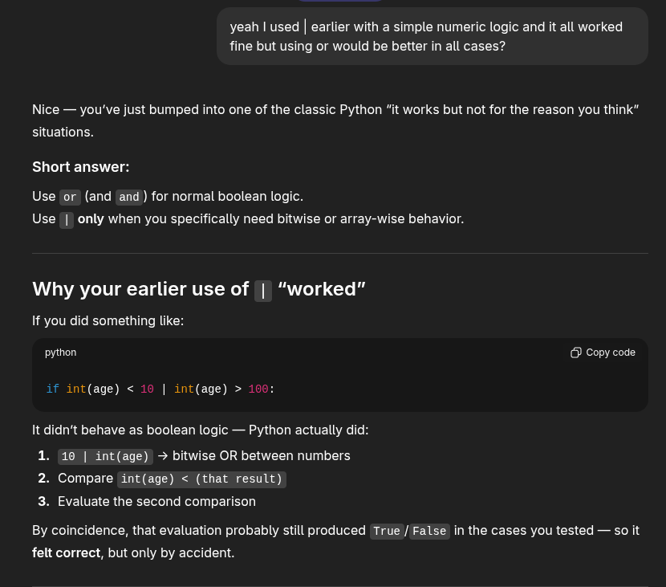

>_Claude example_
>
>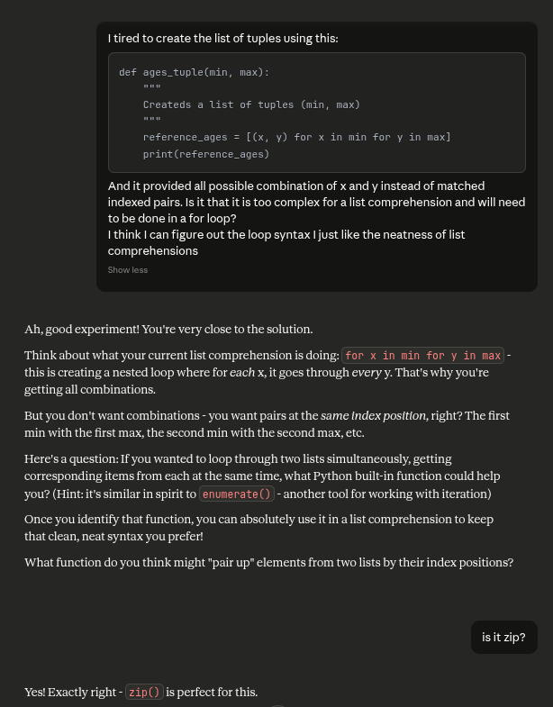

### Acknowledgements

- I would like to thank [Tim Nelson](https://www.github.com/TravelTimN) for the readme builder template.
- I would like to thank Code Institute mentor Can Sücüllü for his support and guidance during the development of this project.
- I would like to thank the [Code Institute Discord community](https://discord-portal.codeinstitute.net) for the moral support; it kept me going during periods of self doubt and impostor syndrome.
- I would like to thank my partner, Niall, for believing in me and allowing me to make this transition into software development.