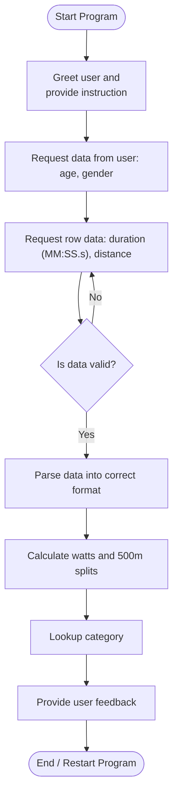
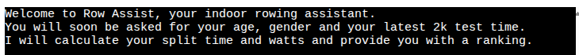
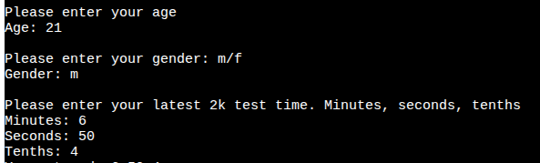
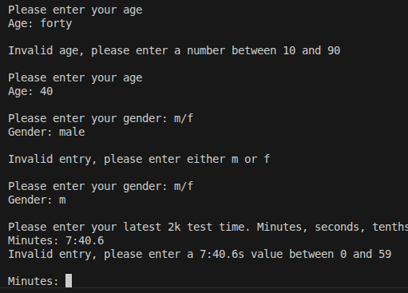
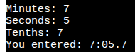
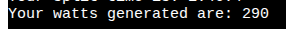
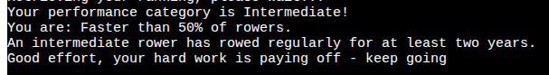
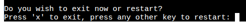
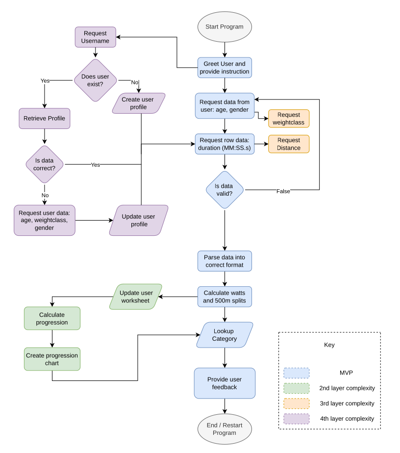

# [row_assist](https://row-assist-0ee155171c88.herokuapp.com)

Developer: Geraldine Morey ([geraldine-mor](https://www.github.com/geraldine-mor))

[](https://www.github.com/geraldine-mor/row_assist/commits/main)
[](https://www.github.com/geraldine-mor/row_assist/commits/main)
[](https://www.github.com/geraldine-mor/row_assist)
[](https://row-assist-0ee155171c88.herokuapp.com)

Row Assist is a command-line indoor rowing assistant that takes the user's indoor rowing performance data and calculates the watts generated and average /500m split time, compares the user's performance to a reference table and returns a ranking. The application runs as a single-use session. The user enters their personal attributes (ie age, gender) and their latest rowing test data and receives feedback. This model reflects real-world rowing practice where rowing tests occur as distinct events. This also allows the feedback to remain visible on screen until the program is exited or run again. Running the program implies either a new test has been completed or another uses wishes to evaluate their data. 

⚠️ --- Screenshot of amiresponsive if illustrations used--- ⚠️<br>
source: [row_assist amiresponsive](https://ui.dev/amiresponsive?url=https://row-assist-0ee155171c88.herokuapp.com)

## Instructions

⚠️ --- Currently set for the MVP and will need updating as features added --- ⚠️

**How to use Row Assist**

You will be greeted and asked to enter your age - _please enter a number between 10 and 90_<br>

You will then be asked to enter your gender - _please enter either m or f_<br>

You will finally be asked to enter the time of your last 2k test. _This is broken in to 3 inputs, minutes, seconds and tenths to ensure correct input format and is similar to web platforms that have separate input boxes for the different parts of the time._

With this information, the program calculates the 2 standard rowing metrics of split time and watts, and reports these back to you.

The program also delivers a performance category or ranking and exlpains how this category compares to other rowers.

## UX

### The 5 Planes of UX

#### 1. Strategy

> **MVP** <br>
> A command-line indoor rowing assistant that collects basic user and performance data, calculates derived metrics, compares them against performance standards and provides tailored, categorised feedback to the user.

**Purpose**
- Provide users with alternative metrics for their workout 
- Give users feedback about their performance 

**Primary User Needs**
- Receive meaningful feedback for a completed indoor row
- Compare performance against global averages 
- Receive a performance rank for completed indoor row

**Business Goals**
- Offer a reliable tool for analysing rowing performance
- Accurately calculate metrics and classify user performance
- Deliver feedback in a clear and insightful manner

#### 2. Scope

**[Features](#features)** (see below)

⚠️ --- Currently set for the MVP and will need updating as features added --- ⚠️

**Content Requirements**
- Input content - user attributes (age, gender) and row performance data (time)
- Reference content - Google sheet containing categorised, searchable data sorted by gender, age range, watt threshold and performance category
- Derived content - system calculated values for watt output and 500m split time 
- Feedback content - calculated values (split and watts) and performance category (beginner - world record) with contextual explanation of category
- Future content - stored historical user performance data, trend analysis, visual charts
<br>

**Content Constraints**
- Only 2000m tests accepted in MVP
- Age must map to a defined range
- Only male & female categories supported - HW and LW removed from MVP due to lack of available data
- User data is not persisted between sessions in MVP
- The deployment terminal is set to 80 columns wide by 24 rows.

#### 3. Structure

**Information Architecture**
- **Hierarchy**:
  - User demography and row performance data input as the primary focus for ease of use

⚠️ --- Currently set for the MVP and will need updating as features added --- ⚠️

**User Flow**
1. User opens the app → user views greeting and instructions
2. User enters data as prompted → system checks data for type and validity → generates error message if invalid, proceeds if valid
3. System computes metrics and compares to reference document → user receives feedback messages
4. User chooses whether to exit the program or restart

#### 4. Skeleton

**[Wireframes](#wireframes)** (see below)

#### 5. Surface

⚠️ --- If colour text is used, keep otherwise delete --- ⚠️<br>
**Visual Design Elements**
- **[Colours](#colour-scheme)** (see below)

## Wireframes

To follow best practice, a flowchart was created to showcase the progression of the Python app.
I used [draw.io](https://www.drawio.com/) to design my app flowchart.
I used [chatGPT](http://www.chatgpt.com) and [Mermaid Chart](http://www.mermaid.ai) to convert the flowchart to an interactive mermaid version.



Source: [Mermaid Flowchart for Row Assist](https://mermaid.ai/app/projects/212e9a6a-2b8a-4b72-be94-8a77217d6f55/diagrams/ccf39e03-b715-4b69-a013-1cd69f5dea7f/version/v0.1/edit)

## User Stories

| Target | Expectation | Outcome |
| --- | --- | --- |
| As a user | I want to be greeted and receive clear instruction throughout | so that I understand and can use the app fully and easily. |
| As a rower | I would like to input my age, gender and 2000m time | so that the app can evaluate my performance. |
| As a rower | I would like the app to calculate my split time and watts | so that I can understand more about my workout. |
| As a rower | I would like the application to compare my output to reference data | so that I can receive a category ranking relevant to my demographic. |
| As a rower | I would like information about my ranking category | so that I can understand how my ranking compares to others. |
| As a coach | I would like to choose between exiting the program and restarting | so that all my athletes can enter their data. |
| As a returning user | I would like the application to store my performance tests | so that I can track improvements over time. |
| As a returning user | I would like to see trends in my performance | so that I can evaluate my training effectivesness. |
| As a returning user | I would like to see visual charts of my performance history | so that progress is easy to interpret and compare. |
| As a rower | I would like to enter alternative distances | so that I can evaluate performance over a range of tests. |
| As a lightweight rower | I would like to see weight class adjustments | so that rankings are fair and my feedback is relevant |
| As a new user | I would like to create a profile | so that my details don't need to be re-entered each time. |
| As a returning user | I would like to update my profile | so that performance comparisons remain valid. |
| As a coach | I want to view performance data for multple athletes | so that can track progression and develop training interventions. | 

## Features

⚠️ --- Currently set for the MVP and will need updating as features added --- ⚠️

### Existing Features

| Feature | Notes | Screenshot |
| --- | --- | --- |
| Greeting | Greets the user and provides instruction about how to use the app. |  |
| Data Collection | Requests the user's age, gender and latest 2k test time. |  |
| Input Validation | Validates that the age provided is in the range 10-90, that the gender provided is either m or f and that the minutes and seconds are in the range 0-59 and the tenths 0-9. |  |
| Time Transformation | Time inputs are _collated_ into the format mm:ss.d for user display and _parsed_ to total seconds for calculations. |  |
| Split-time Calculation | Calculates the split-time from the data provided and displays it to the user. |  |
| Watts Calculation | Calculates watts from from the generated split-time value and displays it to the user. |  |
| Performance Ranking | Retrieves the performance category and correspoding description from the relevant Google Sheets worksheet based on age, gender and watts value and displays them to the user. |  |
| Program Exit / Restart | Asks the user to exit or restart. Exit closes the program safely and restart begins the program again with a clear terminal. |  |

### Future Features

- **Basic History Storage**: Store the user's row times with timestamps to enable performance tracking over time.
- **Performance progression comparison**: Provide user feedback based on past performances.  
- **Data Visualisation**: Add charts and graphs to visually represent performance trends.
- **Add Multiple Distance Options**: Allow the user to input the row distance instead of only 2000m.
- **Add User Weight Category**: Allow user to specify weight category (HW or LW) for fairer comparisons.
- **User Profile Management**: Allow users to create, access and update profiles containing demographic information and performance history.
- **Dashboard**: Provide users with user-friendly dashboard to view results and feedback.
- **User login types and roles**: Implement different user types and assign roles to facilitate coach oversight of multiple athletes.
- **Dashboard Options**: Provide setup options for single user or coach/club group management.
- **Predictive Analytics**: Use historical performance data to predict future results giving the athletes personalised training targets.
- **Multilingual Support**: Add support for multiple languages to make the app more accessible to a global audience.
- **Mobile App Integration**: Develop a mobile version of the app for rowing feedback in any gym and on the go.
- **Reporting and Exporting**: Generate and export detailed reports in PDF or CSV format for deeper analysis of performance metrics over time.
- **API Integration**: Provide an API for integrating with other third-party services, such as concept2's ErgData or fitness trackers and heart rate monitors.

## Tools & Technologies

| Tool / Tech | Use |
| --- | --- |
| [](https://markdown.2bn.dev) | Generate README and TESTING templates. |
| [](https://git-scm.com) | Version control. (`git add`, `git commit`, `git push`, `git pull`) |
| [](https://github.com) | Secure online code storage. |
| [](https://code.visualstudio.com) | Local IDE for development. |
| [](https://www.python.org) | Back-end programming language. |
| [](https://www.heroku.com) | Hosting the deployed back-end site. |
| [](https://docs.google.com/spreadsheets) | Storing data from my Python app. |
| [](https://chat.openai.com) | Help with initial planning. |
| [](https://www.drawio.com) | Flow diagrams for mapping the app's logic. |
| [](https://www.w3schools.com) | Tutorials/Reference Guide. |
| [](https://stackoverflow.com) | Tutorials/Reference Guide. |
| [](https://claude.ai) | Help debug, troubleshoot, and explain things. |

## Database Design

### Data Model
⚠️ --- Add information here about the data used, storage, etc. Create new flowchart for data flow rather than logic. --- ⚠️
#### Flowchart

To follow best practice, a flowchart was created for the app's logic, and mapped out using [Draw.io](https://www.draw.io). The flowchart below represents the main process of this Python program. It shows the entire cycle of the application.



#### Classes & Functions

⚠️ INSTRUCTIONS ⚠️

Use this space to explain your Python classes (if applicable) and functions. Examples below for inspiration, although Love Sandwiches doesn't use this example `Person` class/object.

⚠️ --- END --- ⚠️

The program uses classes as a blueprint for the project's object-oriented programming (OOP). This allows for the object to be reusable and callable where necessary.

```python
class Person:
    """ Insert docstring comments here """
    def __init__(self, name, age, health, inventory):
        self.name = name
        self.age = age
        self.health = health
        self.inventory = inventory
```

The primary functions used on this application are:

- `get_sales_data()`
    - Get sales figures input from the user.
- `validate_data()`
    - Converts all string values into integers.
- `update_worksheet()`
    - Update the relevant worksheet with the data provided.
- `calculate_surplus_data()`
    - Compare sales with stock and calculate the surplus for each item type.
- `get_last_5_entries_sales()`
    - Collects columns of data from sales worksheet.
- `calculate_stock_data()`
    -  Calculate the average stock for each item type, adding 10%.
- `main()`
    - Run all program functions.

#### Imports

⚠️ INSTRUCTIONS ⚠️

Use this space to explain your Python imports and packages, with some common examples found below.

⚠️ --- END --- ⚠️

I've used the following Python packages and external imports.

- `gspread`: used with the Google Sheets API
- `google.oauth2.service_account`: used for the Google Sheets API credentials
- `time`: used for adding time delays
- `os`: used for adding a `clear()` function
- `colorama`: used for including color in the terminal
- `random`: used to get a random choice from a list

## Agile Development Process

### GitHub Projects

⚠️ TIP ⚠️

Consider adding screenshots of your Projects Board(s), Issues (open and closed), and Milestone tasks.

⚠️ --- END ---⚠️

[GitHub Projects](https://www.github.com/geraldine-mor/love_sandwiches/projects) served as an Agile tool for this project. Through it, EPICs, User Stories, issues/bugs, and Milestone tasks were planned, then subsequently tracked on a regular basis using the Kanban project board.


### GitHub Issues

[GitHub Issues](https://www.github.com/geraldine-mor/love_sandwiches/issues) served as an another Agile tool. There, I managed my User Stories and Milestone tasks, and tracked any issues/bugs.

| Link | Screenshot |
| --- | --- |
| [](https://www.github.com/geraldine-mor/love_sandwiches/issues?q=is%3Aissue%20is%3Aopen%20-label%3Abug) |  |
| [](https://www.github.com/geraldine-mor/love_sandwiches/issues?q=is%3Aissue%20is%3Aclosed%20-label%3Abug) |  |

### MoSCoW Prioritization

I've decomposed my Epics into User Stories for prioritizing and implementing them. Using this approach, I was able to apply "MoSCoW" prioritization and labels to my User Stories within the Issues tab.

- **Must Have**: guaranteed to be delivered - required to Pass the project (*max ~60% of stories*)
- **Should Have**: adds significant value, but not vital (*~20% of stories*)
- **Could Have**: has small impact if left out (*the rest ~20% of stories*)
- **Won't Have**: not a priority for this iteration - future features

## Testing

> [!NOTE]  
> For all testing, please refer to the [TESTING.md](TESTING.md) file.

## Deployment

Code Institute has provided a [template](https://github.com/Code-Institute-Org/python-essentials-template) to display the terminal view of this backend application in a modern web browser. This is to improve the accessibility of the project to others.

The live deployed application can be found deployed on [Heroku](https://love-sandwiches-gm-c489adc8c525.herokuapp.com).

### Heroku Deployment

This project uses [Heroku](https://www.heroku.com), a platform as a service (PaaS) that enables developers to build, run, and operate applications entirely in the cloud.

Deployment steps are as follows, after account setup:

- Select **New** in the top-right corner of your Heroku Dashboard, and select **Create new app** from the dropdown menu.
- Your app name must be unique, and then choose a region closest to you (EU or USA), then finally, click **Create App**.
- From the new app **Settings**, click **Reveal Config Vars**, and set the value of **KEY** to `PORT`, and the **VALUE** to `8000` then select **ADD**.
- If using any confidential credentials, such as **CREDS.JSON**, then these should be pasted in the Config Variables as well.
- Further down, to support dependencies, select **Add Buildpack**.
- The order of the buildpacks is important; select `Python` first, then `Node.js` second. (if they are not in this order, you can drag them to rearrange them)

Heroku needs some additional files in order to deploy properly.

- [requirements.txt](requirements.txt)
- [Procfile](Procfile)
- [.python-version](.python-version)

You can install this project's **[requirements.txt](requirements.txt)** (*where applicable*) using:

- `pip3 install -r requirements.txt`

If you have your own packages that have been installed, then the requirements file needs updated using:

- `pip3 freeze --local > requirements.txt`

The **[Procfile](Procfile)** can be created with the following command:

- `echo web: node index.js > Procfile`

The **[.python-version](.python-version)** file tells Heroku the specific version of Python to use when running your application.

- `3.12` (or similar)

For Heroku deployment, follow these steps to connect your own GitHub repository to the newly created app:

Either (*recommended*):

- Select **Automatic Deployment** from the Heroku app.

Or:

- In the Terminal/CLI, connect to Heroku using this command: `heroku login -i`
- Set the remote for Heroku: `heroku git:remote -a app_name` (*replace `app_name` with your app name*)
- After performing the standard Git `add`, `commit`, and `push` to GitHub, you can now type:
	- `git push heroku main`

The Python terminal window should now be connected and deployed to Heroku!

### Google Sheets API

This application uses [Google Sheets](https://docs.google.com/spreadsheets) to handle a "makeshift" database on the live site.

⚠️ INSTRUCTIONS ⚠️

The sample Sheet below follows along with the CI Love Sandwiches lessons, so make sure to refactor to your own project requirements.

⚠️ --- END ---⚠️

To run your own version of this application, you will need to create your own Google Sheet with three sheets named `sales`, `surplus`, and `stock` in the following format:

| cheese ham | tom moz | chicken salad | egg salad | hummus veg | ham egg |
| --- | --- | --- | --- | --- | --- |
| sample data | sample data | sample data | sample data | sample data | sample data |
| sample data | sample data | sample data | sample data | sample data | sample data |
| sample data | sample data | sample data | sample data | sample data | sample data |

A credentials file in `.JSON` format from the Google Cloud Platform is also mandatory:

[Google Cloud Platform](https://console.cloud.google.com)

1. From the dashboard click on "Select a project", and then the **NEW PROJECT** button.
2. Give the project a name, and then click **CREATE**.
3. Click **SELECT PROJECT** to get to the project page.
4. From the side-menu, select "APIs & Services", then select "Library".
5. Search for the "Google Drive API", select it, and then click on **ENABLE**.
6. Click on the **CREATE CREDENTIALS** button.
7. From the "Which API are you using?" dropdown menu, choose **Google Drive API**.
8. For the "What data will you be accessing?" question, select **Application Data**.
9. Click **Next**.
10. Enter a "Service Account" name, then click **Create**.
11. In the "Role" dropdown box, choose "Basic" > "Editor", then press **Continue**.
12. "Grant users access to this service account" can be left blank. Click **DONE**.
13. On the next page, click on the "Service Account" that has been created.
14. On the next page, click on the "Keys" tab.
15. Click on the "Add Key" dropdown, and select "Create New Key".
16. Select `JSON`, and then click **Create**. This will trigger the `.json` file with your API credentials in it to download to your machine locally.
17. For local deployment, this needs to be renamed to `creds.json`.
18. Repeat steps 4 & 5 above to add the "Google Sheets API".
19. Copy the `client_email` that is in the `creds.json` file.
20. Share your Google Sheet to the `client_email`, ensuring "Editing" is enabled.
21. Add the `creds.json` file to your `.gitignore` file, so as not to push your credentials to GitHub publicly.


### Local Development

This project can be cloned or forked in order to make a local copy on your own system.

For either method, you will need to install any applicable packages found within the [requirements.txt](requirements.txt) file.

- `pip3 install -r requirements.txt`.

If using any confidential credentials, such as `CREDS.json` or `env.py` data, these will need to be manually added to your own newly created project as well.

#### Cloning

You can clone the repository by following these steps:

1. Go to the [GitHub repository](https://www.github.com/geraldine-mor/love_sandwiches).
2. Locate and click on the green "Code" button at the very top, above the commits and files.
3. Select whether you prefer to clone using "HTTPS", "SSH", or "GitHub CLI", and click the "copy" button to copy the URL to your clipboard.
4. Open "Git Bash" or "Terminal".
5. Change the current working directory to the location where you want the cloned directory.
6. In your IDE Terminal, type the following command to clone the repository:
	- `git clone https://www.github.com/geraldine-mor/love_sandwiches.git`
7. Press "Enter" to create your local clone.

Alternatively, if using Ona (formerly Gitpod), you can click below to create your own workspace using this repository.

[](https://gitpod.io/#https://www.github.com/geraldine-mor/love_sandwiches)

**Please Note**: in order to directly open the project in Ona (Gitpod), you should have the browser extension installed. A tutorial on how to do that can be found [here](https://www.gitpod.io/docs/configure/user-settings/browser-extension).

#### Forking

By forking the GitHub Repository, you make a copy of the original repository on our GitHub account to view and/or make changes without affecting the original owner's repository. You can fork this repository by using the following steps:

1. Log in to GitHub and locate the [GitHub Repository](https://www.github.com/geraldine-mor/love_sandwiches).
2. At the top of the Repository, just below the "Settings" button on the menu, locate and click the "Fork" Button.
3. Once clicked, you should now have a copy of the original repository in your own GitHub account!

### Local VS Deployment

⚠️ INSTRUCTIONS ⚠️

Use this space to discuss any differences between the local version you've developed, and the live deployment site. Generally, there shouldn't be [m]any major differences, so if you honestly cannot find any differences, feel free to use the following example:

⚠️ --- END --- ⚠️

There are no remaining major differences between the local version when compared to the deployed version online.

## Credits

⚠️ INSTRUCTIONS ⚠️

In the following sections, you need to reference where you got your content, media, and any extra help. It is common practice to use code from other repositories and tutorials (which is totally acceptable), however, it is important to be very specific about these sources to avoid potential plagiarism.

⚠️ --- END ---⚠️

### Content

⚠️ INSTRUCTIONS ⚠️

Use this space to provide attribution links for any borrowed code snippets, elements, and resources. Ideally, you should provide an actual link to every resource used, not just a generic link to the main site. If you've used multiple components from the same source (such as Bootstrap), then you only need to list it once, but if it's multiple Codepen samples, then you should list each example individually. If you've used AI for some assistance (such as ChatGPT or Perplexity), be sure to mention that as well. A few examples have been provided below to give you some ideas.

Eventually you'll want to learn how to use Git branches. Here's a helpful tutorial called [Learn Git Branching](https://learngitbranching.js.org) to bookmark for later.

⚠️ --- END ---⚠️

| Source | Notes |
| --- | --- |
| [Markdown Builder](https://markdown.2bn.dev) | Help generating Markdown files |
| [Chris Beams](https://chris.beams.io/posts/git-commit) | "How to Write a Git Commit Message" |
| [Love Sandwiches](https://codeinstitute.net) | Code Institute walkthrough project inspiration |
| [Real Python](https://realpython.com/python-quiz-application) | Inspiration for a quiz app |
| [BroCode](https://www.youtube.com/watch?v=ag8NtD1e0Kc) | Inspiration for hangman game |
| [Python Tutor](https://pythontutor.com) | Additional Python help |
| [Colorama](https://www.youtube.com/watch?v=u51Zjlnui4Y) | Adding color in Python |
| [StackOverflow](https://stackoverflow.com/a/50921841) | Clear screen in Python |
| [ChatGPT](https://chatgpt.com) | Help with code logic and explanations |

### Media

⚠️ INSTRUCTIONS ⚠️

Use this space to provide attribution links to any media files borrowed from elsewhere (images, videos, audio, etc.). If you're the owner (or a close acquaintance) of some/all media files, then make sure to specify this information. Let the assessors know that you have explicit rights to use the media files within your project. Ideally, you should provide an actual link to every media file used, not just a generic link to the main site, unless it's AI-generated artwork.

Looking for some media files? Here are some popular sites to use. The list of examples below is by no means exhaustive.

- Images
    - [Pexels](https://www.pexels.com)
    - [Unsplash](https://unsplash.com)
    - [Pixabay](https://pixabay.com)
    - [Lorem Picsum](https://picsum.photos) (placeholder images)
    - [Wallhere](https://wallhere.com) (wallpaper / backgrounds)
    - [This Person Does Not Exist](https://thispersondoesnotexist.com) (reload to get a new person)
- Audio
    - [Audio Micro](https://www.audiomicro.com/free-sound-effects)
    - [Button Clicks](https://www.zapsplat.com/sound-effect-category/button-clicks)
    - [Lasers & Weapons](https://www.zapsplat.com/sound-effect-category/lasers-and-weapons/page/5)
    - [Puzzle Music](https://soundimage.org/puzzle-music)
    - [Camtasia Audio](https://library.techsmith.com/camtasia/assets/Audio)
- Video
    - [Videvo](https://www.videvo.net)
- Image Compression
    - [TinyPNG](https://tinypng.com) (for images <5MB)
    - [CompressPNG](https://compresspng.com) (for images >5MB)

A few examples have been provided below to give you some ideas on how to do your own Media credits.

⚠️ --- END ---⚠️

| Source | Notes |
| --- | --- |
| [ASCII Art Archive](https://www.asciiart.eu) | Pre-defined ASCII art |
| [TEXT-IMAGE](https://www.text-image.com) | Converting an image to ASCII art |
| [Patorjk](https://patorjk.com/software/taag) | Converting text to ASCII art |

### Acknowledgements

⚠️ INSTRUCTIONS ⚠️

Use this space to provide attribution and acknowledgement to any supports that helped, encouraged, or supported you throughout the development stages of this project. It's always lovely to appreciate those that help us grow and improve our developer skills. A few examples have been provided below to give you some ideas.

⚠️ --- END ---⚠️

- I would like to thank my Code Institute mentor, [Tim Nelson](https://www.github.com/TravelTimN) for the support throughout the development of this project.
- I would like to thank the [Code Institute](https://codeinstitute.net) Tutor Team for their assistance with troubleshooting and debugging some project issues.
- I would like to thank the [Code Institute Slack community](https://code-institute-room.slack.com) and [Code Institute Discord community](https://discord-portal.codeinstitute.net) for the moral support; it kept me going during periods of self doubt and impostor syndrome.
- I would like to thank my partner, for believing in me, and allowing me to make this transition into software development.
- I would like to thank my employer, for supporting me in my career development change towards becoming a software developer.
