# Testing

> [!NOTE]  
> Return back to the [README.md](README.md) file.

## Code Validation

### Python

I have used the recommended [PEP8 CI Python Linter](https://pep8ci.herokuapp.com) to validate all of my Python files.

Initially some of the files had several issues but all were largely whitespace errors or line length errors and were easily fixed, prior to deployment.

> 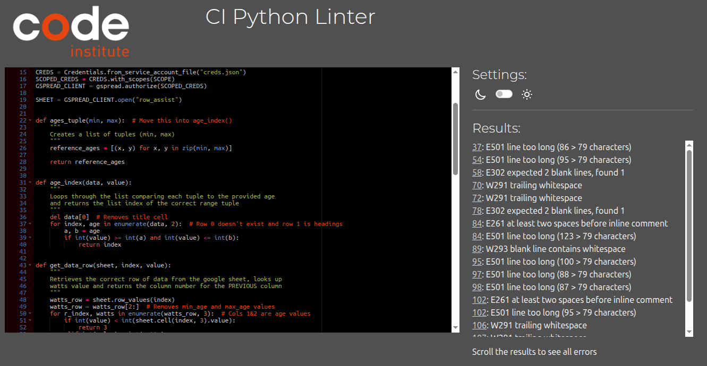

⚠️ Reconfirm all linter links show no errors before submission ⚠️

| Directory | File | URL | Screenshot | Notes |
| --- | --- | --- | --- | --- |
|  | [calc.py](https://github.com/geraldine-mor/row_assist/blob/main/calc.py) | [PEP8 CI Link](https://pep8ci.herokuapp.com/https://raw.githubusercontent.com/geraldine-mor/row_assist/main/calc.py) | 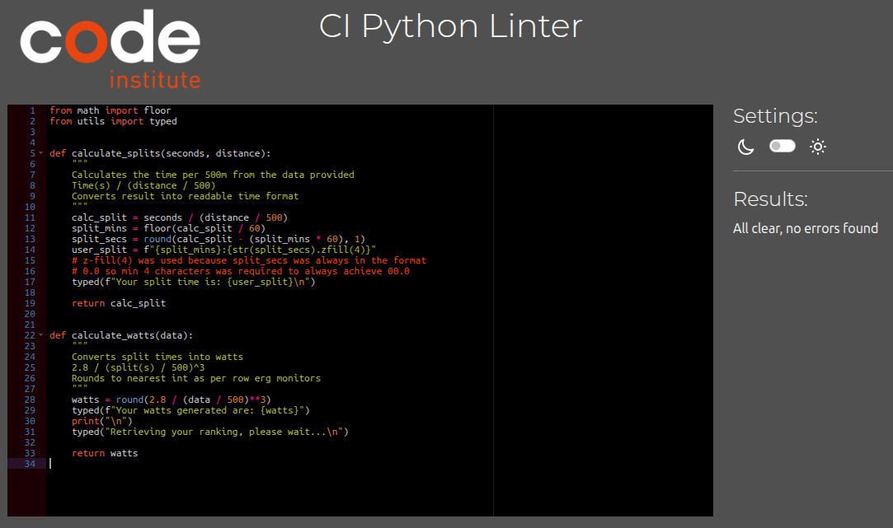 |  |
|  | [inputs.py](https://github.com/geraldine-mor/row_assist/blob/main/inputs.py) | [PEP8 CI Link](https://pep8ci.herokuapp.com/https://raw.githubusercontent.com/geraldine-mor/row_assist/main/inputs.py) | 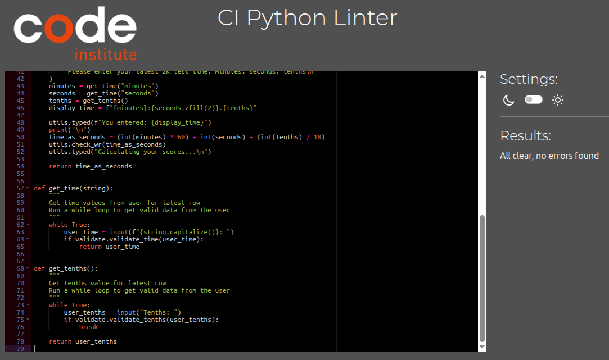 |  |
|  | [ref_data.py](https://github.com/geraldine-mor/row_assist/blob/main/ref_data.py) | [PEP8 CI Link](https://pep8ci.herokuapp.com/https://raw.githubusercontent.com/geraldine-mor/row_assist/main/ref_data.py) | 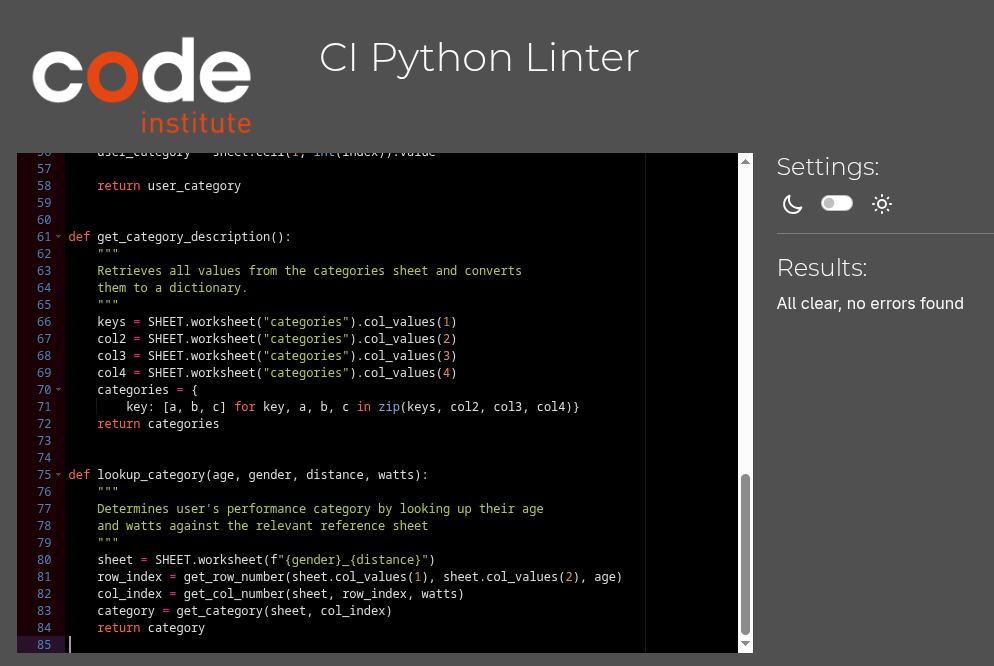 |  |
|  | [run.py](https://github.com/geraldine-mor/row_assist/blob/main/run.py) | [PEP8 CI Link](https://pep8ci.herokuapp.com/https://raw.githubusercontent.com/geraldine-mor/row_assist/main/run.py) | 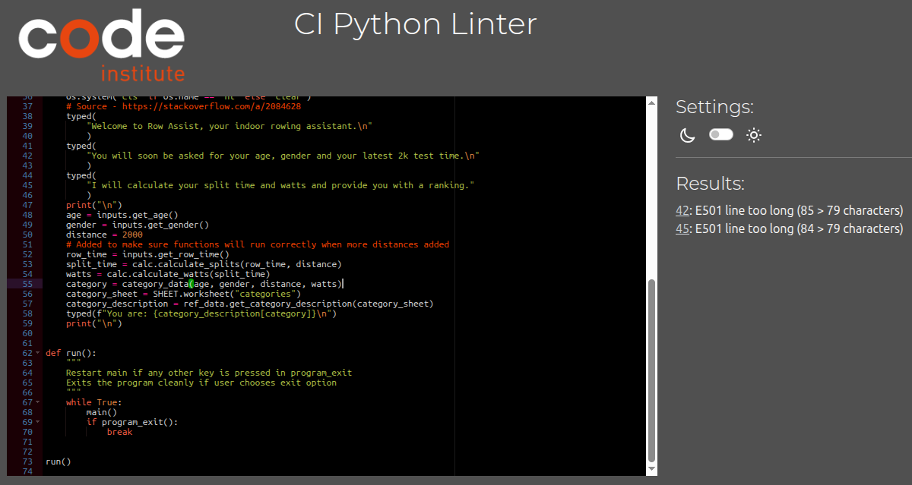 |  |
|  | [utils.py](https://github.com/geraldine-mor/row_assist/blob/main/utils.py) | [PEP8 CI Link](https://pep8ci.herokuapp.com/https://raw.githubusercontent.com/geraldine-mor/row_assist/main/utils.py) | 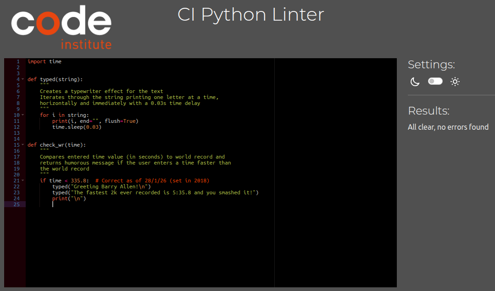 |  |
|  | [validate.py](https://github.com/geraldine-mor/row_assist/blob/main/validate.py) | [PEP8 CI Link](https://pep8ci.herokuapp.com/https://raw.githubusercontent.com/geraldine-mor/row_assist/main/validate.py) | 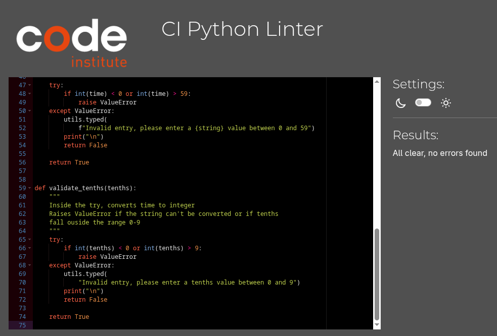 |  |

## Responsiveness

Due to the command-line nature of this application, traditional responsiveness testing across devices and screen sizes is not applicable.

## Browser Compatibility

This project is a Python command-line only application deployed via The Code Institue's web terminal interface. Browser compatibility testing focuses on whether the terminal interface renders correctly rather than application-specific functionality and as such is not applicable.

## Lighthouse Audit

Lighthouse audits are not applicable to this project since they do not test the Python command-line application but rather focus on the provided interface.

## Defensive Programming

Defensive programming was manually tested with the below user acceptance testing to ensure invalid or unexpected user input is handled with clear feedback and without causing the program to crash.

| Feature | Expectation | Test | Result | Screenshot |
| --- | --- | --- | --- | --- |
| User Mode Selection | Feature is expected to accept valid login credentials. | Entered "demo" when prompted for login. | Login accepted, user authenticated, stored age and gender retrieved from USER data. |  |
| | Feature is expected to accept empty string for guest mode. | Pressed enter with no value when prompted for login. | Guest mode activated, user prompted to enter age and gender manually. |  |
| | Feature is expected to reject invalid login credentials. | Entered "john" when prompted for login. | Error message displayed: "I'm sorry that login is not recognised, please try again or press 'Enter' to continue as a guest" and re-prompted. | 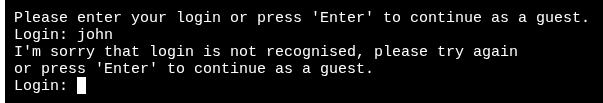 |
| | Feature is expected to be case-insensitive for valid login. | Entered "DEMO" and "Demo" when prompted for login. | Both accepted as valid login, user authenticated successfully. |  |
| Age Input Validation | Feature is expected to reject non-numeric input. | Entered "forty" when prompted for the age. | Error message displayed: "Invalid age, please enter a number between 10 and 90" and re-prompted | 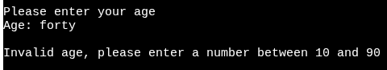 |
| | Feature is expected to reject age entries below minimum (10). | Entered "7" for the age. | Error message displayed: "I'm sorry, only ages between 10 and 90 can be accepted" and re-prompted. | 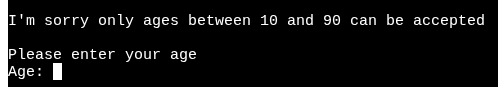 |
|  | Feature is expected to reject age entries above the maximum (90). | Entered "92" for the age. | Error message displayed: "I'm sorry, only ages between 10 and 90 can be accepted" and re-prompted. | 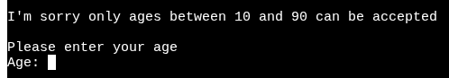 |
| | Feature is expected to accept valid age input at the boundaries. | Entered "10" and "90". | Both ages accepted without issue and program moved on to next step. | 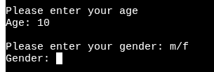  |
|  | Feature is expected to reject blank entries. | Pressed enter with no value entered. | Error message displayed: "Invalid age, please enter a number between 10 and 90" and re-prompted. | 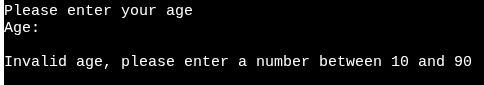 |
| Gender Input Validation | Feature is expected to reject all non-alphabetic characters. | Entered "4" and "," for the gender. | Error message displayed both times: "Invalid entry, please enter either m or f" and re-prompted. |  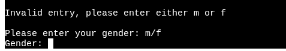 |
|  | Feature is expected to reject any letter except "m" or "f". | Entered "g" for the gender. | Error message displayed: "Invalid entry, please enter either m or f" and re-prompted. | 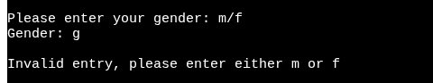 |
|  | Feature is expected to reject multiple characters or words. | Entered "male" for the gender. | Error message displayed: "Invalid entry, please enter either m or f" and re-prompted. | 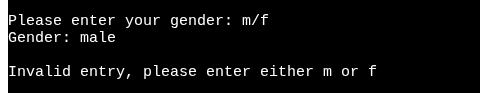 |
|  | Feature is expected to accept lowercase valid input. | Entered both "m" and "f" for gender. | Both values accepted without issue and program moved on to next step. | 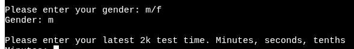   |
|  | Feature is expected to accept uppercase valid input. | Entered both "M" and "F" for gender. | Both values accepted without issue and program moved on to next step. | 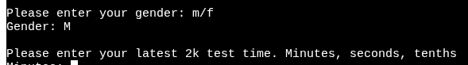   |
|  | Feature is expected to reject blank entries. | Pressed enter with no value entered. | Error message displayed: "Invalid entry, please enter either m or f" and re-prompted. | 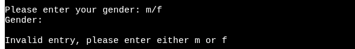 |
| Minutes Input Validation | Feature is expected to reject non-numeric characters. | Entered "z" for minutes. | Error message displayed: "Invalid entry, please enter a minutes value between 0 and 59" and re-prompted. | 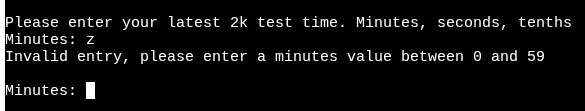 |
|  | Feature is expected to reject negative values | Entered "-3" for minutes. | Error message displayed: "Invalid entry, please enter a minutes value between 0 and 59" and re-prompted. | 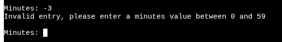 |
|  | Feature is expected to reject values above 59 | Entered "64" for minutes. | Error message displayed: "Invalid entry, please enter a minutes value between 0 and 59" and re-prompted. | 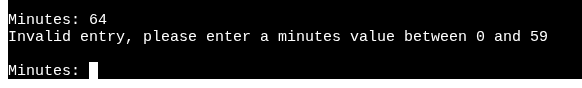 |
|  | Feature is expected to reject blank input | Pressed enter with no value entered. | Error message displayed: "Invalid entry, please enter a minutes value between 0 and 59" and re-prompted. | 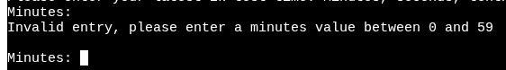 |
|  | Feature is expected to accept valid minutes value at the boundaries | Entered "0" and "59" for minutes. | Both values accepted without issue and program moved on to next step. | 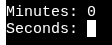 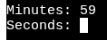 |
| Seconds Input Validation | Feature is expected to reject non-numeric characters. | Entered "x" for seconds. | Error message displayed: "Invalid entry, please enter a seconds value between 0 and 59" and re-prompted. | 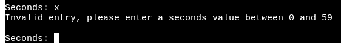 |
|  | Feature is expected to reject negative values | Entered "-7" for seconds. | Error message displayed: "Invalid entry, please enter a seconds value between 0 and 59" and re-prompted. | 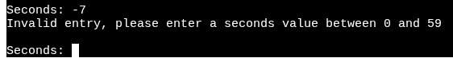 |
|  | Feature is expected to reject values above 59 | Entered "72" for seconds. | Error message displayed: "Invalid entry, please enter a seconds value between 0 and 59" and re-prompted. | 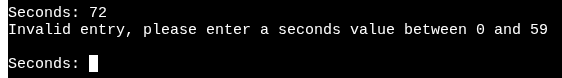 |
|  | Feature is expected to reject blank input | Pressed enter with no value entered. | Error message displayed: "Invalid entry, please enter a seconds value between 0 and 59" and re-prompted. | 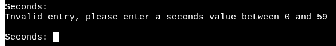 |
|  | Feature is expected to accept valid seconds values at the boundaries | Entered "0" and "59" for seconds. | Both values accepted without issue and program moved on to next step. | 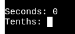 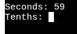 |
| Tenths Input Validation | Feature is expected to reject non-numeric characters. | Entered "d" for tenths. | Error message displayed: "Invalid entry, please enter a tenths value between 0 and 9" and re-prompted. | 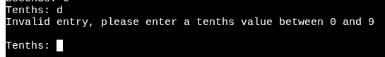 |
|  | Feature is expected to reject negative values | Entered "-1" for tenths. | Error message displayed: "Invalid entry, please enter a tenths value between 0 and 9" and re-prompted. | 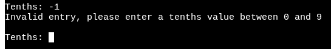 |
|  | Feature is expected to reject values above 9. | Entered "12" for tenths. | Error message displayed: "Invalid entry, please enter a tenths value between 0 and 9" and re-prompted. | 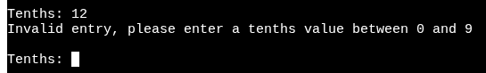 |
|  | Feature is expected to reject blank input. | Pressed enter with no value entered. | Error message displayed: "Invalid entry, please enter a tenths value between 0 and 9" and re-prompted. | 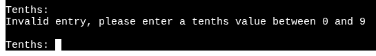 |
|  | Feature is expected to accept valid tenths values at the boundaries. | Entered "0" and "9" for tenths. | Both values accepted without issue and program moved on to next step. | 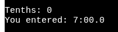 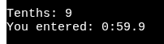 |
| Program Restart | Feature is expected to restart the program with a clear screen when any key except "x" is entered. | Entered "w", "Insert" and "7" as well as no value. | All values initiated the program restart and cleared the visible window though scrolling upward revealed uncleared text (see [known issues](#known-issues)). | 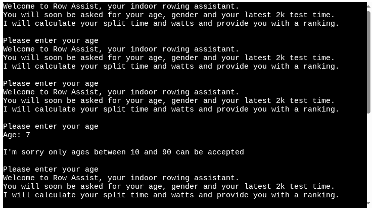 |
| Program Exit | Feature is expected to safely close the program if "x" is entered. | Entered "x" and "X". | Program closed with no issues. | 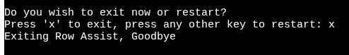  | 

### Edge Case Handling

| Feature | Test | Result | Screenshot |
| --- | --- | --- | --- |
| World Record Detection | Entered time faster than world record (5:35.8) | Humorous message displayed: "Greetings Barry Allen! The fastest 2k ever recorded is 5:35.8 and you smashed it!" | 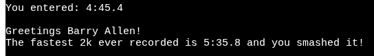 |

## User Story Testing

| Target | Expectation | Outcome |  |
| --- | --- | --- | --- |
| As a user | I want to be greeted and receive clear instruction throughout | so that I understand and can use the app fully and easily. |  |
| As a rower | I would like to input my age, gender and 2000m time | so that the app can evaluate my performance. |  |
| As a rower | I would like the app to calculate my split time and watts | so that I can understand more about my workout. | 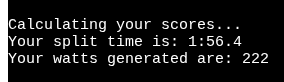 |
| As a rower | I would like the application to compare my output to reference data | so that I can receive a category ranking relevant to my demographic. | 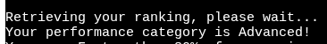 |
| As a rower | I would like information about my ranking category | so that I can understand how my ranking compares to others. | 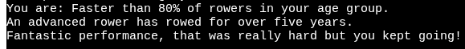 |
| As a coach | I would like to choose between exiting the program and restarting | so that all my athletes can enter their data. |  |

## Bugs

### Fixed Bugs

I used [GitHub Issues](https://www.github.com/geraldine-mor/row_assist/issues) to track and manage bugs and issues during the development stages of my project.

All previously closed/fixed bugs can be tracked [here](https://www.github.com/geraldine-mor/row_assist/issues?q=is%3Aissue+is%3Aclosed+label%3Abug).

⚠️ Add screenshots of bugs when complete ⚠️

### Unfixed Bugs

Any remaining open issues can be tracked [here](https://www.github.com/geraldine-mor/row_assist/issues?q=is%3Aissue+is%3Aopen+label%3Abug).

### Known Issues

| Issue | Screenshot |
| --- | --- |
| When using a system clear function, any text above the height of the terminal (24 lines) does not clear, and remains when scrolling up. |  |
| ⚠️ The `colorama` terminal colors are fainter on Heroku when compared to the IDE locally. |  |
| ⚠️ Emojis are cut-off when viewing the application from Firefox. |  |
| The Python terminal doesn't work well with Safari, and sometimes users cannot type in the application. | 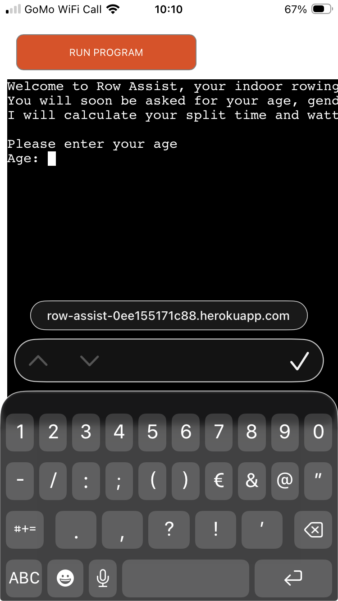 |
| If a user types `CTRL`+`C` in the terminal on the live site, they can manually stop the application and receive and error. | 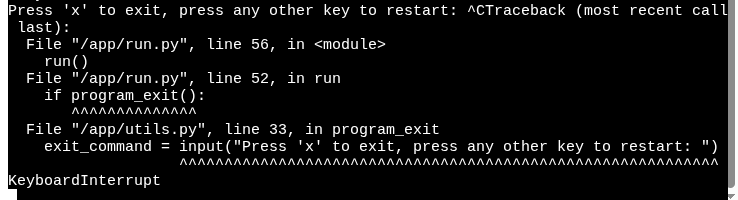 |

> [!IMPORTANT]  
> There are no remaining bugs that I am aware of, though, even after thorough testing, I cannot rule out the possibility.

